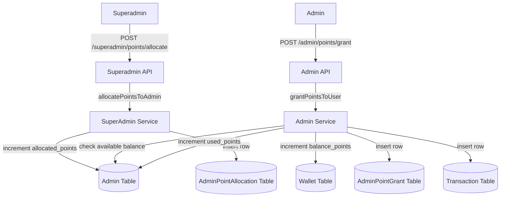
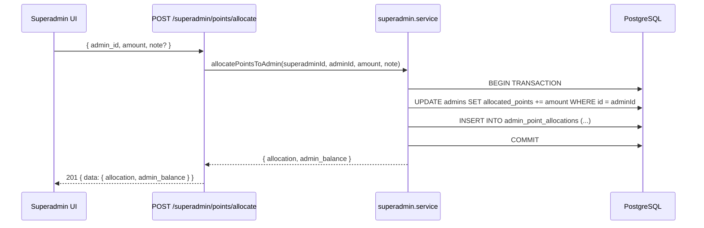
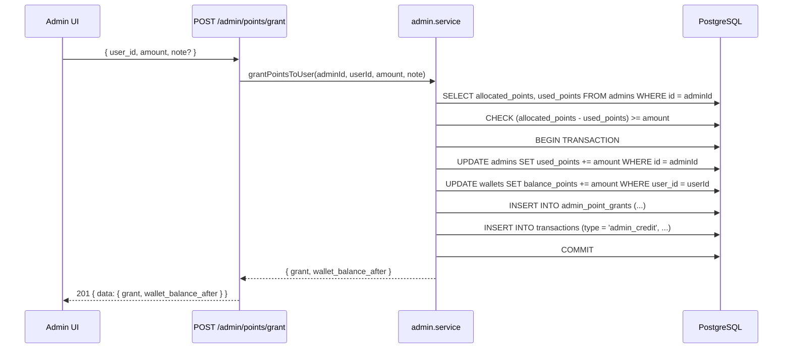

# Design Document: Admin Point Allocation

## Overview

The Admin Point Allocation system introduces a two-tier credit model: the Superadmin allocates a point budget to each Admin, and Admins use that budget to directly credit points into user wallets — bypassing any UPI/deposit flow. This gives the platform operator full control over how many points each Admin can distribute, with a complete audit trail at every level.

The feature extends the existing `Admin` model with balance tracking fields, adds a new `AdminPointAllocation` table for the superadmin→admin ledger, and adds a new `AdminPointGrant` table for the admin→user ledger. All mutations are atomic Prisma transactions to prevent double-spending.

## Architecture



## Sequence Diagrams

### Superadmin Allocates Points to Admin



### Admin Grants Points to User



## Components and Interfaces

### Component 1: SuperAdmin Point Allocation Service

**Purpose**: Handles allocating points from superadmin to admins and querying allocation history/balances.

**Interface**:
```typescript
interface AllocatePointsToAdminParams {
  superadminId: string;
  adminId: string;
  amount: number;       // must be > 0
  note?: string;
}

interface AdminAllocationBalance {
  admin_id: string;
  username: string;
  allocated_points: bigint;
  used_points: bigint;
  available_points: bigint;  // allocated - used
}

interface AdminPointAllocationRecord {
  id: string;
  admin_id: string;
  admin_username: string;
  allocated_by: string;      // superadmin id
  amount_points: bigint;
  note: string | null;
  created_at: Date;
}

// Service functions
function allocatePointsToAdmin(params: AllocatePointsToAdminParams): Promise<{
  allocation: AdminPointAllocationRecord;
  admin_balance: AdminAllocationBalance;
}>;

function listAdminBalances(): Promise<{ admins: AdminAllocationBalance[] }>;

function listAllocationHistory(filters?: {
  admin_id?: string;
  limit?: number;
  offset?: number;
}): Promise<{ allocations: AdminPointAllocationRecord[]; total: number }>;
```

**Responsibilities**:
- Validate `amount > 0`
- Atomically increment `Admin.allocated_points` and insert `AdminPointAllocation` row
- Return updated balance alongside the new allocation record

### Component 2: Admin Point Grant Service

**Purpose**: Handles admins granting points directly to their users, enforcing the available balance constraint.

**Interface**:
```typescript
interface GrantPointsToUserParams {
  adminId: string;
  userId: string;
  amount: number;       // must be > 0
  note?: string;
}

interface AdminPointGrantRecord {
  id: string;
  admin_id: string;
  user_id: string;
  user_username: string;
  amount_points: bigint;
  note: string | null;
  created_at: Date;
}

// Service functions
function grantPointsToUser(params: GrantPointsToUserParams): Promise<{
  grant: AdminPointGrantRecord;
  wallet_balance_after: bigint;
}>;

function listGrantHistory(adminId: string, filters?: {
  user_id?: string;
  limit?: number;
  offset?: number;
}): Promise<{ grants: AdminPointGrantRecord[]; total: number }>;

function getAdminBalance(adminId: string): Promise<AdminAllocationBalance>;
```

**Responsibilities**:
- Validate `amount > 0`
- Verify user belongs to this admin (ownership check)
- Enforce `(allocated_points - used_points) >= amount` — throw `INSUFFICIENT_ADMIN_BALANCE` if not
- Atomically: increment `Admin.used_points`, increment `Wallet.balance_points`, insert `AdminPointGrant` row, insert `Transaction` row (type: `admin_credit`)
- Return updated wallet balance

### Component 3: SuperAdmin Points Panel (Frontend)

**Purpose**: React page at `/superadmin/points` for allocating points to admins and viewing history.

**Interface**:
```typescript
// Page state
interface SuperAdminPointsPageState {
  admins: AdminAllocationBalance[];
  allocations: AdminPointAllocationRecord[];
  selectedAdminId: string;
  amount: number;
  note: string;
  loading: boolean;
  error: string | null;
}
```

**Responsibilities**:
- Display table of all admins with `allocated / used / available` columns
- Provide "Allocate Points" form (select admin, enter amount, optional note)
- Display paginated allocation history table (when, how much, to which admin)

### Component 4: Admin Points Panel (Frontend)

**Purpose**: React page at `/admin/points` for granting points to users and viewing grant history.

**Interface**:
```typescript
interface AdminPointsPageState {
  adminBalance: AdminAllocationBalance;
  users: UserSummary[];
  grants: AdminPointGrantRecord[];
  selectedUserId: string;
  amount: number;
  note: string;
  loading: boolean;
  error: string | null;
}
```

**Responsibilities**:
- Display admin's own balance card (`allocated / used / available`)
- Provide "Add Points to User" form (select user, enter amount, optional note)
- Display paginated grant history table (when, how much, to which user)

## Data Models

### Schema Changes: Admin Model

```typescript
// Additions to existing Admin model in schema.prisma
model Admin {
  // ... existing fields ...
  allocated_points  BigInt   @default(0)
  used_points       BigInt   @default(0)

  // New relations
  received_allocations AdminPointAllocation[] @relation("AllocatedToAdmin")
  point_grants         AdminPointGrant[]
}
```

**Validation Rules**:
- `allocated_points >= 0` always
- `used_points >= 0` always
- `used_points <= allocated_points` always (enforced at application layer before each grant)

### Schema: AdminPointAllocation Table

```typescript
model AdminPointAllocation {
  id            String   @id @default(uuid())
  admin_id      String                          // recipient admin
  allocated_by  String                          // superadmin id (string, not FK to keep flexible)
  amount_points BigInt
  note          String?
  created_at    DateTime @default(now()) @db.Timestamptz

  // Relations
  admin Admin @relation("AllocatedToAdmin", fields: [admin_id], references: [id])

  @@index([admin_id], name: "idx_admin_point_allocations_admin_id")
  @@map("admin_point_allocations")
}
```

**Validation Rules**:
- `amount_points > 0`
- `admin_id` must reference an existing, active admin

### Schema: AdminPointGrant Table

```typescript
model AdminPointGrant {
  id            String   @id @default(uuid())
  admin_id      String                          // granting admin
  user_id       String                          // recipient user
  amount_points BigInt
  note          String?
  created_at    DateTime @default(now()) @db.Timestamptz

  // Relations
  admin Admin @relation(fields: [admin_id], references: [id])
  user  User  @relation(fields: [user_id], references: [id])

  @@index([admin_id], name: "idx_admin_point_grants_admin_id")
  @@index([user_id], name: "idx_admin_point_grants_user_id")
  @@map("admin_point_grants")
}
```

**Validation Rules**:
- `amount_points > 0`
- `user_id` must belong to the granting `admin_id`

### TransactionType Enum Extension

```typescript
// Add to existing TransactionType enum in schema.prisma and @matka/types
enum TransactionType {
  deposit
  withdrawal
  bet_deduction
  winning_credit
  admin_credit    // NEW — direct point grant from admin
}
```

## Algorithmic Pseudocode

### Core Algorithm: grantPointsToUser

```typescript
async function grantPointsToUser(params: GrantPointsToUserParams): Promise<GrantResult> {
  // PRECONDITIONS:
  // - params.amount > 0
  // - params.adminId is a valid, active admin
  // - params.userId belongs to params.adminId

  const { adminId, userId, amount, note } = params;

  if (amount <= 0) throw new AppError('INVALID_AMOUNT');

  // Ownership check
  const user = await prisma.user.findUnique({ where: { id: userId } });
  if (!user || user.admin_id !== adminId) throw new AppError('FORBIDDEN');

  // Balance check (read-then-write inside transaction to prevent race)
  const result = await prisma.$transaction(async (tx) => {
    const admin = await tx.admin.findUnique({ where: { id: adminId } });
    if (!admin) throw new AppError('FORBIDDEN');

    const available = admin.allocated_points - admin.used_points;
    if (BigInt(amount) > available) throw new AppError('INSUFFICIENT_ADMIN_BALANCE');

    // 1. Increment admin used_points
    await tx.admin.update({
      where: { id: adminId },
      data: { used_points: { increment: BigInt(amount) } },
    });

    // 2. Increment user wallet
    const wallet = await tx.wallet.update({
      where: { user_id: userId },
      data: { balance_points: { increment: BigInt(amount) } },
    });

    // 3. Record grant
    const grant = await tx.adminPointGrant.create({
      data: { admin_id: adminId, user_id: userId, amount_points: BigInt(amount), note },
    });

    // 4. Record transaction for user's history
    await tx.transaction.create({
      data: {
        user_id: userId,
        type: TransactionType.AdminCredit,
        amount_points: BigInt(amount),
        balance_after: wallet.balance_points,
        status: TransactionStatus.Completed,
        approved_by: adminId,
      },
    });

    return { grant, wallet_balance_after: wallet.balance_points };
  });

  // POSTCONDITIONS:
  // - admin.used_points increased by amount
  // - user wallet.balance_points increased by amount
  // - AdminPointGrant row created
  // - Transaction row created with type = admin_credit
  // - available balance = allocated_points - used_points (invariant maintained)

  return result;
}
```

**Preconditions:**
- `amount > 0`
- `userId` belongs to `adminId`
- `(admin.allocated_points - admin.used_points) >= amount`

**Postconditions:**
- `admin.used_points` increased by `amount`
- `wallet.balance_points` increased by `amount`
- One `AdminPointGrant` row inserted
- One `Transaction` row inserted with `type = admin_credit`, `status = completed`

**Loop Invariants:** N/A (no loops; single atomic transaction)

### Core Algorithm: allocatePointsToAdmin

```typescript
async function allocatePointsToAdmin(params: AllocatePointsToAdminParams): Promise<AllocationResult> {
  // PRECONDITIONS:
  // - params.amount > 0
  // - params.adminId is a valid, active admin

  const { superadminId, adminId, amount, note } = params;

  if (amount <= 0) throw new AppError('INVALID_AMOUNT');

  const result = await prisma.$transaction(async (tx) => {
    const admin = await tx.admin.findUnique({ where: { id: adminId } });
    if (!admin || !admin.is_active) throw new AppError('NOT_FOUND');

    // 1. Increment admin allocated_points
    const updatedAdmin = await tx.admin.update({
      where: { id: adminId },
      data: { allocated_points: { increment: BigInt(amount) } },
    });

    // 2. Record allocation
    const allocation = await tx.adminPointAllocation.create({
      data: {
        admin_id: adminId,
        allocated_by: superadminId,
        amount_points: BigInt(amount),
        note,
      },
    });

    return {
      allocation,
      admin_balance: {
        admin_id: adminId,
        username: admin.username,
        allocated_points: updatedAdmin.allocated_points,
        used_points: updatedAdmin.used_points,
        available_points: updatedAdmin.allocated_points - updatedAdmin.used_points,
      },
    };
  });

  // POSTCONDITIONS:
  // - admin.allocated_points increased by amount
  // - AdminPointAllocation row created
  // - admin.used_points unchanged

  return result;
}
```

**Preconditions:**
- `amount > 0`
- `adminId` references an existing, active admin

**Postconditions:**
- `admin.allocated_points` increased by `amount`
- One `AdminPointAllocation` row inserted
- `admin.used_points` unchanged

## Key Functions with Formal Specifications

### getAdminBalance()

```typescript
async function getAdminBalance(adminId: string): Promise<AdminAllocationBalance>
```

**Preconditions:**
- `adminId` is a non-empty string referencing an existing admin

**Postconditions:**
- Returns `{ allocated_points, used_points, available_points }` where `available_points = allocated_points - used_points`
- `available_points >= 0` always (invariant: `used_points <= allocated_points`)

### listAllocationHistory()

```typescript
async function listAllocationHistory(filters?: {
  admin_id?: string;
  limit?: number;
  offset?: number;
}): Promise<{ allocations: AdminPointAllocationRecord[]; total: number }>
```

**Preconditions:**
- `limit` if provided must be `> 0` and `<= 100`
- `offset` if provided must be `>= 0`

**Postconditions:**
- Returns records ordered by `created_at DESC`
- `total` reflects count matching the filter (for pagination)
- If `admin_id` filter provided, only returns allocations for that admin

### listGrantHistory()

```typescript
async function listGrantHistory(
  adminId: string,
  filters?: { user_id?: string; limit?: number; offset?: number }
): Promise<{ grants: AdminPointGrantRecord[]; total: number }>
```

**Preconditions:**
- `adminId` is a valid admin id
- Only returns grants made by `adminId` (scoped — admin cannot see other admins' grants)

**Postconditions:**
- Returns records ordered by `created_at DESC`
- All returned grants have `admin_id === adminId`

## Example Usage

```typescript
// Superadmin allocates 5000 points to an admin
const result = await allocatePointsToAdmin({
  superadminId: 'sa-uuid',
  adminId: 'admin-uuid',
  amount: 5000,
  note: 'Monthly budget Q3',
});
// result.admin_balance.available_points === 5000n

// Admin grants 200 points to a user
const grant = await grantPointsToUser({
  adminId: 'admin-uuid',
  userId: 'user-uuid',
  amount: 200,
  note: 'Welcome bonus',
});
// grant.wallet_balance_after === previous_balance + 200n

// Admin tries to grant more than available — throws INSUFFICIENT_ADMIN_BALANCE
await grantPointsToUser({
  adminId: 'admin-uuid',
  userId: 'user-uuid',
  amount: 99999,  // exceeds available
});
// throws AppError('INSUFFICIENT_ADMIN_BALANCE')
```

## Correctness Properties

- **Balance conservation**: For every `grantPointsToUser(amount)` call that succeeds, `admin.used_points` increases by exactly `amount` AND `wallet.balance_points` increases by exactly `amount` — atomically.
- **No overdraft**: `admin.used_points` can never exceed `admin.allocated_points`. The check and increment happen inside the same Prisma transaction with a row-level read, preventing race conditions.
- **Audit completeness**: Every successful `grantPointsToUser` produces exactly one `AdminPointGrant` row and one `Transaction` row with `type = admin_credit`.
- **Allocation monotonicity**: `admin.allocated_points` only ever increases (allocations are additive, never subtracted).
- **Ownership isolation**: An admin can only grant points to users where `user.admin_id === admin.id`. Cross-admin grants are rejected with `FORBIDDEN`.

## Error Handling

### Error Scenario 1: Insufficient Admin Balance

**Condition**: Admin attempts to grant more points than `(allocated_points - used_points)`
**Response**: HTTP 400 with error code `INSUFFICIENT_ADMIN_BALANCE`
**Recovery**: Admin must request more allocation from superadmin

### Error Scenario 2: User Not Under Admin

**Condition**: Admin attempts to grant points to a user belonging to a different admin
**Response**: HTTP 403 with error code `FORBIDDEN`
**Recovery**: Admin must use a user from their own roster

### Error Scenario 3: Invalid Amount

**Condition**: `amount <= 0` or non-integer value
**Response**: HTTP 400 with error code `INVALID_AMOUNT`
**Recovery**: Client must submit a positive integer amount

### Error Scenario 4: Admin Not Found / Inactive

**Condition**: Superadmin tries to allocate to a non-existent or deactivated admin
**Response**: HTTP 404 with error code `NOT_FOUND`
**Recovery**: Superadmin must activate the admin first

### Error Scenario 5: Concurrent Grant Race

**Condition**: Two simultaneous grant requests from the same admin that together exceed available balance
**Response**: One succeeds, the other gets `INSUFFICIENT_ADMIN_BALANCE` (Prisma transaction serialization)
**Recovery**: Retry after checking current balance

## Testing Strategy

### Unit Testing Approach

Test service functions in isolation with a mocked Prisma client:
- `allocatePointsToAdmin` — happy path, invalid amount, inactive admin
- `grantPointsToUser` — happy path, insufficient balance, wrong admin ownership, invalid amount
- `getAdminBalance` — returns correct `available_points` calculation
- `listAllocationHistory` / `listGrantHistory` — pagination, filtering

### Property-Based Testing Approach

**Property Test Library**: `fast-check` (already used in the project)

Key properties to test:
- For any sequence of valid `allocatePointsToAdmin(amount_i)` calls, `admin.allocated_points === sum(amount_i)`
- For any sequence of valid `grantPointsToUser(amount_j)` calls, `admin.used_points === sum(amount_j)` and `admin.available_points === allocated - used`
- `grantPointsToUser` never succeeds when `amount > available_points` (no overdraft property)
- After any grant, `user.wallet.balance_points` increases by exactly the granted amount

### Integration Testing Approach

End-to-end API tests using the test database:
- Full flow: superadmin allocates → admin grants → verify wallet and balances
- Concurrent grant attempts — verify exactly one succeeds when both would exceed balance
- History endpoints return correct records in correct order

## Performance Considerations

- `AdminPointAllocation` and `AdminPointGrant` tables are indexed on `admin_id` for fast history queries
- The balance check + increment is a single Prisma transaction — no separate SELECT before UPDATE to avoid TOCTOU
- Pagination (`limit`/`offset`) is required on all history endpoints to avoid unbounded result sets
- Admin balance (`allocated_points`, `used_points`) is stored directly on the `Admin` row — no aggregation query needed for the balance card

## Security Considerations

- All superadmin point allocation endpoints are protected by `requireRole(Role.SuperAdmin)`
- All admin grant endpoints are protected by `requireRole(Role.Admin)`
- Admin can only grant to users where `user.admin_id === req.user.userId` — enforced in service layer, not just router
- `amount` is validated as a positive integer before any DB write
- `allocated_by` field stores the superadmin's id for full audit trail
- `approved_by` on the `Transaction` row stores the admin's id for user-facing transaction history

## Dependencies

- **Prisma** — schema migration for new fields/tables, atomic transactions
- **@matka/types** — extend `TransactionType` enum with `admin_credit`
- **Express** — new route handlers in `superadmin.router.ts` and `admin.router.ts`
- **React + React Router** — new pages `/superadmin/points` and `/admin/points`
- **fast-check** — property-based tests (already a dev dependency)
