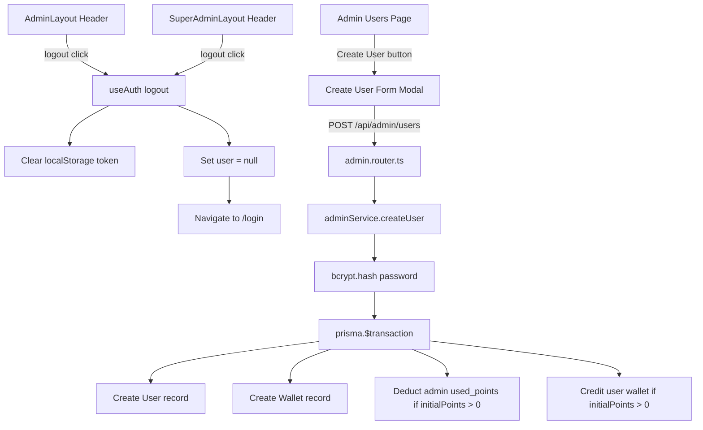
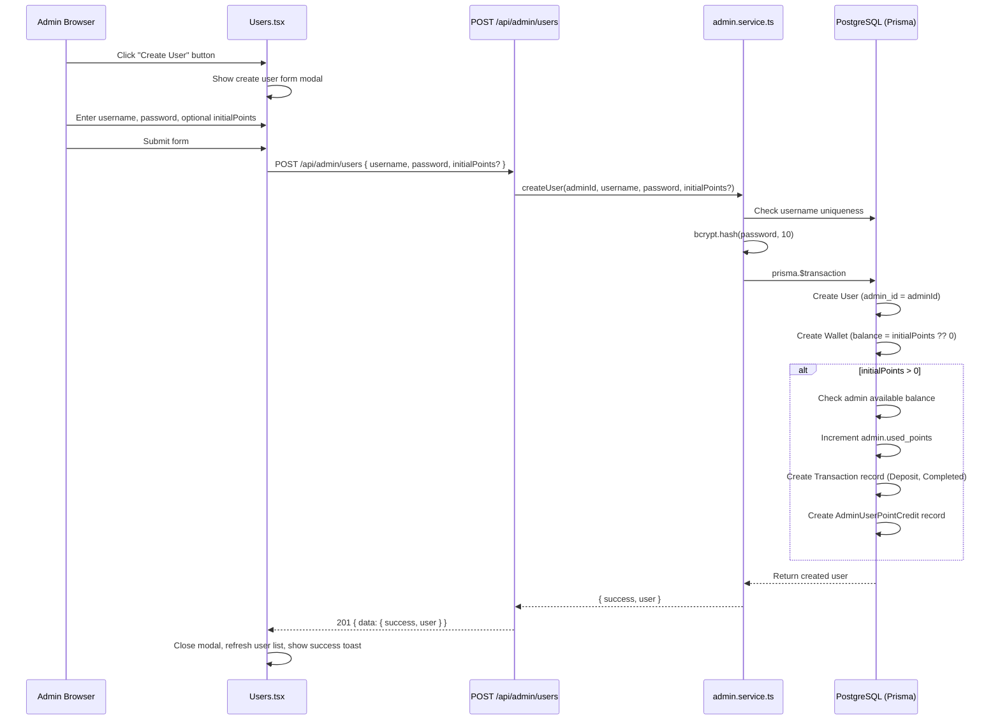
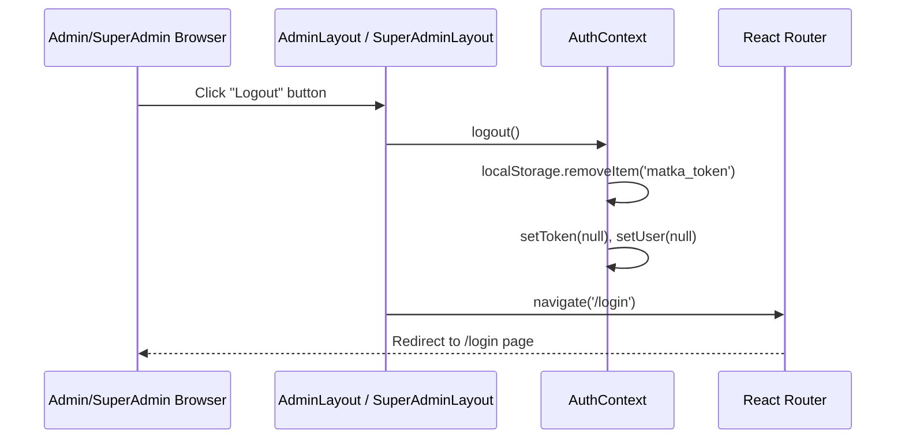

# Design Document: Admin User Management

## Overview

This feature adds three capabilities to the Matka game platform admin panels:

1. **Create User** — Admins can create new users directly from the `/admin/users` page, with optional initial points deducted from the admin's own allocated balance.
2. **Admin Logout** — A logout button in the `AdminLayout` header that clears the JWT and redirects to `/login`.
3. **SuperAdmin Logout** — A logout button in the `SuperAdminLayout` header with the same behavior.

The feature follows existing patterns: the create-user flow mirrors the create-admin flow in `Admins.tsx`; the logout flow uses the `useAuth().logout()` hook already wired in `AuthContext`.

---

## Architecture



---

## Sequence Diagrams

### Create User Flow



### Logout Flow



---

## Components and Interfaces

### Backend: `createUser` Service Function

**File**: `packages/backend/src/api/admin/admin.service.ts`

**Purpose**: Creates a new user under the given admin, optionally crediting initial points from the admin's balance.

```typescript
export interface CreateUserResult {
  success: true;
  user: {
    id: string;
    username: string;
    is_active: boolean;
    created_at: Date;
  };
}

export async function createUser(
  adminId: string,
  username: string,
  password: string,
  initialPoints?: number,
): Promise<CreateUserResult>
```

**Responsibilities**:
- Validate `username` is non-empty and `password` is at least 6 characters
- Hash password with `bcrypt.hash(password, 10)`
- Run everything in `prisma.$transaction`:
  - Create `User` record with `admin_id = adminId`, `role = 'user'`
  - Create `Wallet` record with `balance_points = initialPoints ?? 0`
  - If `initialPoints > 0`: check admin available balance, increment `admin.used_points`, create `Transaction` (Deposit/Completed), create `AdminUserPointCredit`
- Throw `AppError('CONFLICT')` if username already exists (Prisma unique constraint)
- Throw `AppError('INSUFFICIENT_ADMIN_BALANCE')` if admin can't cover `initialPoints`

### Backend: `POST /api/admin/users` Route

**File**: `packages/backend/src/api/admin/admin.router.ts`

**Purpose**: Exposes the `createUser` service function as an authenticated admin endpoint.

```typescript
// POST /api/admin/users
router.post(
  '/users',
  async (req: Request, res: Response, next: NextFunction): Promise<void> => {
    const adminId = req.user!.userId;
    const { username, password, initialPoints } = req.body;
    const result = await adminService.createUser(adminId, username, password, initialPoints);
    res.status(201).json({ data: result });
  },
);
```

**Validation**:
- `username`: required, non-empty string
- `password`: required, minimum 6 characters
- `initialPoints`: optional, positive integer

### Frontend: Create User Form (Users.tsx)

**File**: `packages/frontend/src/pages/admin/Users.tsx`

**Purpose**: Inline collapsible form (same pattern as `Admins.tsx`) that appears when admin clicks "Create User".

**New state**:
```typescript
const [showCreate, setShowCreate] = useState(false);
const [newUsername, setNewUsername] = useState('');
const [newPassword, setNewPassword] = useState('');
const [newInitialPoints, setNewInitialPoints] = useState('');
const [createLoading, setCreateLoading] = useState(false);
const [createError, setCreateError] = useState<string | null>(null);
```

**New handler**:
```typescript
async function handleCreateUser(e: React.FormEvent): Promise<void>
```

**UI placement**: "Create User" button added to the header row alongside the existing "Point History" and "Refresh" buttons. The form expands inline below the header (same as `Admins.tsx` pattern).

### Frontend: Logout Button in AdminLayout (App.tsx)

**File**: `packages/frontend/src/App.tsx`

**Purpose**: Logout button in the `AdminLayout` header that calls `logout()` and navigates to `/login`.

```typescript
// Inside AdminLayout component
const { user, token, logout } = useAuth();
const navigate = useNavigate();

function handleLogout(): void {
  logout();
  navigate('/login');
}
```

**UI placement**: Right side of the header, next to the "Admin" badge. Styled as a small red/gray button.

### Frontend: Logout Button in SuperAdminLayout (App.tsx)

**File**: `packages/frontend/src/App.tsx`

**Purpose**: Same logout behavior for the SuperAdmin panel.

```typescript
// Inside SuperAdminLayout component
const { logout } = useAuth();
const navigate = useNavigate();

function handleLogout(): void {
  logout();
  navigate('/login');
}
```

**UI placement**: Right side of the `SuperAdminLayout` header, next to the "Matka SuperAdmin" title.

---

## Data Models

### Request Body: POST /api/admin/users

```typescript
interface CreateUserRequest {
  username: string;       // required, non-empty
  password: string;       // required, min 6 chars
  initialPoints?: number; // optional, positive integer
}
```

### Response: POST /api/admin/users

```typescript
interface CreateUserResponse {
  data: {
    success: true;
    user: {
      id: string;
      username: string;
      is_active: boolean;
      created_at: string; // ISO date string
    };
  };
}
```

### Existing Prisma Models Used (no schema changes needed)

- `User` — `id`, `username`, `password_hash`, `role`, `admin_id`, `is_active`, `created_at`
- `Wallet` — `user_id`, `balance_points`, `held_points`
- `Admin` — `allocated_points`, `used_points` (same fields used by `creditUserPoints`)
- `Transaction` — used to record the initial deposit if `initialPoints > 0`
- `AdminUserPointCredit` — used to record the credit if `initialPoints > 0`

No database migrations are required.

---

## Algorithmic Pseudocode

### createUser Algorithm

```pascal
PROCEDURE createUser(adminId, username, password, initialPoints?)
  INPUT: adminId (string), username (string), password (string), initialPoints (number, optional)
  OUTPUT: CreateUserResult

  SEQUENCE
    // Validate inputs
    IF username IS empty THEN
      THROW AppError('VALIDATION_ERROR')
    END IF
    IF password.length < 6 THEN
      THROW AppError('VALIDATION_ERROR')
    END IF
    IF initialPoints IS defined AND initialPoints <= 0 THEN
      THROW AppError('VALIDATION_ERROR')
    END IF

    // Hash password
    passwordHash ← bcrypt.hash(password, 10)

    // Atomic transaction
    result ← prisma.$transaction(async tx =>
      SEQUENCE
        // Create user (throws on duplicate username via unique constraint)
        user ← tx.user.create({
          username, password_hash: passwordHash,
          role: 'user', admin_id: adminId
        })

        // Create wallet
        tx.wallet.create({
          user_id: user.id,
          balance_points: initialPoints ?? 0,
          held_points: 0
        })

        IF initialPoints > 0 THEN
          // Check admin balance
          admin ← tx.admin.findUnique({ id: adminId })
          available ← admin.allocated_points - admin.used_points
          IF available < initialPoints THEN
            THROW AppError('INSUFFICIENT_ADMIN_BALANCE')
          END IF

          // Deduct from admin
          tx.admin.update({ used_points: { increment: initialPoints } })

          // Record transaction
          tx.transaction.create({
            user_id: user.id, type: Deposit,
            amount_points: initialPoints,
            balance_after: initialPoints,
            status: Completed, approved_by: adminId
          })

          // Record credit
          tx.adminUserPointCredit.create({
            admin_id: adminId, user_id: user.id, amount: initialPoints
          })
        END IF

        RETURN user
      END SEQUENCE
    )

    RETURN { success: true, user: result }
  END SEQUENCE
END PROCEDURE
```

**Preconditions**:
- `adminId` is a valid admin ID (enforced by JWT middleware)
- `username` is non-empty
- `password` is at least 6 characters
- `initialPoints`, if provided, is a positive integer

**Postconditions**:
- A new `User` record exists with `admin_id = adminId`
- A new `Wallet` record exists for the user with `balance_points = initialPoints ?? 0`
- If `initialPoints > 0`: admin's `used_points` is incremented, a `Transaction` and `AdminUserPointCredit` record exist
- If username was already taken: no records are created (transaction rolled back)

**Loop Invariants**: N/A (no loops in this procedure)

---

## Key Functions with Formal Specifications

### `createUser(adminId, username, password, initialPoints?)`

**Preconditions**:
- `adminId` is non-null and corresponds to an existing Admin record
- `username` is a non-empty string
- `password.length >= 6`
- `initialPoints === undefined || initialPoints > 0`

**Postconditions**:
- On success: `result.success === true` and `result.user.id` is a valid UUID
- On duplicate username: throws `AppError('CONFLICT')` (Prisma P2002 unique constraint)
- On insufficient admin balance: throws `AppError('INSUFFICIENT_ADMIN_BALANCE')`
- All DB writes are atomic — either all succeed or none do

### `handleLogout()` (AdminLayout / SuperAdminLayout)

**Preconditions**:
- `useAuth()` is available in component tree
- `useNavigate()` is available (component is inside `BrowserRouter`)

**Postconditions**:
- `localStorage.getItem('matka_token') === null`
- `AuthContext.user === null`
- Browser is navigated to `/login`

### `handleCreateUser(e)` (Users.tsx)

**Preconditions**:
- `newUsername.trim()` is non-empty
- `newPassword.length >= 6`
- `newInitialPoints` is empty or a positive integer string

**Postconditions**:
- On success: modal closes, user list refreshes, success toast shown
- On error: `createError` state is set with the server error message
- `createLoading` returns to `false` in all cases

---

## Example Usage

### Backend — calling createUser

```typescript
// In admin.router.ts POST /api/admin/users handler
const { username, password, initialPoints } = req.body as {
  username: string;
  password: string;
  initialPoints?: number;
};
const result = await adminService.createUser(
  req.user!.userId,
  username,
  password,
  initialPoints,
);
res.status(201).json({ data: result });
```

### Frontend — Create User API call

```typescript
await api.post('/admin/users', {
  username: newUsername.trim(),
  password: newPassword,
  initialPoints: newInitialPoints ? parseInt(newInitialPoints) : undefined,
});
```

### Frontend — Logout in AdminLayout

```typescript
const { logout } = useAuth();
const navigate = useNavigate();

<button onClick={() => { logout(); navigate('/login'); }}>
  Logout
</button>
```

---

## Correctness Properties

- **User isolation**: A user created by admin A can never be listed or managed by admin B (`admin_id` foreign key enforced at DB level).
- **Balance atomicity**: If `initialPoints > 0`, the wallet credit and admin `used_points` increment always happen together or not at all (Prisma transaction).
- **No over-allocation**: Admin cannot create a user with `initialPoints` exceeding `admin.allocated_points - admin.used_points`.
- **Password never stored in plaintext**: `password_hash` is always the bcrypt output; the raw password is never persisted.
- **Logout completeness**: After `logout()`, both `localStorage` token and React state are cleared; no stale auth state remains.
- **Idempotent navigation**: Calling `navigate('/login')` after `logout()` always lands on the login page regardless of prior route.

---

## Error Handling

### Duplicate Username

**Condition**: `POST /api/admin/users` with a username that already exists in the `users` table.
**Response**: Prisma throws `P2002` unique constraint error → caught and mapped to `AppError('CONFLICT')` → HTTP 409.
**Frontend**: `createError` state shows "Username already taken." message in the form.

### Insufficient Admin Balance

**Condition**: `initialPoints` exceeds `admin.allocated_points - admin.used_points`.
**Response**: `AppError('INSUFFICIENT_ADMIN_BALANCE')` → HTTP 400.
**Frontend**: `createError` state shows the server error message.

### Invalid Input

**Condition**: Empty username or password shorter than 6 characters.
**Response**: Client-side validation catches this before the API call; `createError` is set locally.
**Backend**: Also validates and throws `AppError('VALIDATION_ERROR')` → HTTP 400 as a second line of defense.

### Logout While Offline

**Condition**: User clicks logout with no network connection.
**Response**: `logout()` is purely client-side (clears localStorage + React state). No network call is made, so logout always succeeds regardless of connectivity.

---

## Testing Strategy

### Unit Testing Approach

- `createUser` service: test with valid inputs, duplicate username, insufficient balance, zero/negative initialPoints.
- Test that `bcrypt.hash` is called with the raw password (mock bcrypt).
- Test that `prisma.$transaction` is called atomically (mock prisma).

### Property-Based Testing Approach

**Property Test Library**: `fast-check` (already used in the project)

- **Property**: For any valid `(adminId, username, password)`, `createUser` either returns a user with `admin_id === adminId` or throws a known `AppError`.
- **Property**: `initialPoints` deducted from admin balance equals exactly the wallet credit — no rounding or partial credits.
- **Property**: After `logout()`, `localStorage.getItem('matka_token')` is always `null`.

### Integration Testing Approach

- `POST /api/admin/users` with a real test DB: verify user + wallet rows created, admin `used_points` incremented.
- Verify the route is protected: unauthenticated request returns 401, non-admin JWT returns 403.

---

## Security Considerations

- The `POST /api/admin/users` route is protected by `authenticate` + `requireRole(Role.Admin)` middleware — same as all other admin routes.
- Passwords are hashed with bcrypt (cost factor 10) before storage — consistent with the existing auth service pattern.
- The `admin_id` is taken from the verified JWT (`req.user!.userId`), not from the request body — admins cannot create users under other admins.
- Logout clears the JWT from `localStorage` immediately on the client; the token itself is short-lived (server-side expiry still applies).

---

## Dependencies

- **bcryptjs** — already used in `auth.service.ts` for password hashing; no new dependency needed.
- **Prisma Client** — already configured; no schema changes required.
- **React Router v6 `useNavigate`** — already used throughout the frontend; needed in `AdminLayout` and `SuperAdminLayout` for post-logout redirect.
- **`useAuth` hook** — already exported from `AuthContext.tsx`; provides `logout()`.
