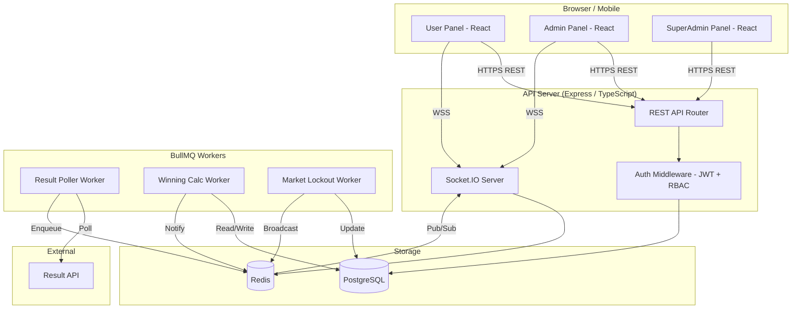

# Design Document: Matka Game Platform

## Overview

The Matka Game Platform is a web-based, mobile-first number game application supporting three roles — SuperAdmin, Admin, and User — across a single deployable monorepo. The platform manages Matka markets, bet placement, UPI-based wallet operations, automatic result fetching, real-time bet dashboards, and winning calculation.

### Key Design Goals

- **Mobile-first, app-like UX**: React SPA with bottom navigation, 44×44px touch targets, and responsive layouts from 320px to 1920px.
- **Role isolation**: Three distinct panels (User, Admin, SuperAdmin) with JWT-based RBAC enforced at both API and UI layers.
- **Correctness and auditability**: Immutable bet and transaction records; idempotent winning calculation via database-level deduplication.
- **Real-time Admin dashboard**: WebSocket push for live bet updates within the 20-minute pre-result window.
- **Automated operations**: BullMQ workers handle result polling, market lockout scheduling, and winning calculation without manual intervention.

### Technology Summary

| Layer | Technology |
|---|---|
| Backend | Node.js 20 LTS, TypeScript, Express |
| Frontend | React 18, TypeScript, Vite, TailwindCSS |
| Database | PostgreSQL 16 |
| Cache / Queue | Redis 7, BullMQ |
| Real-time | Socket.IO (server + client) |
| Auth | JWT (access + refresh tokens), bcrypt |
| ORM | Prisma |
| API style | REST (JSON) |

---

## Architecture

### High-Level Architecture



### Request Flow

1. Client sends HTTPS request with `Authorization: Bearer <JWT>`.
2. Auth middleware validates JWT, extracts `{ userId, role, adminId }` claims.
3. Route handler enforces role guard; queries PostgreSQL via Prisma.
4. For bet placement, a database transaction atomically deducts wallet balance and inserts the bet record.
5. For real-time events, the API server publishes to a Redis Pub/Sub channel; the Socket.IO server subscribes and broadcasts to connected clients in the relevant room.

### Worker Architecture

BullMQ workers run as separate Node.js processes (or the same process in development) and communicate with the main API only through the database and Redis:

- **Result Poller**: Scheduled repeatable job (configurable interval, default 5 min). Fetches results from the external Result API, stores them, and enqueues a `winning-calculation` job.
- **Winning Calculation Worker**: Processes one market result at a time. Uses a PostgreSQL advisory lock keyed on `(market_id, result_cycle_id)` to guarantee idempotency.
- **Market Lockout Scheduler**: On server startup and after any market edit, schedules a delayed BullMQ job for each market's lockout time. The job sets `market.status = 'locked'` and publishes a lock event to Redis.

---

## Components and Interfaces

### Backend Module Structure

```
src/
  api/
    auth/          # Registration, login, token refresh, password change
    markets/       # CRUD for markets (SuperAdmin), list for users
    bets/          # Bet placement, bet history
    wallet/        # Deposit/withdrawal requests, transaction history
    admin/         # Admin user management, transaction approval, bet dashboard
    superadmin/    # Admin CRUD, platform config, winning multipliers
  workers/
    resultPoller.ts
    winningCalculation.ts
    marketLockout.ts
  realtime/
    socketServer.ts   # Socket.IO setup, room management, event broadcasting
    pubsub.ts         # Redis Pub/Sub publisher/subscriber helpers
  middleware/
    auth.ts           # JWT verification, role guard factory
    errorHandler.ts
  lib/
    prisma.ts         # Prisma client singleton
    redis.ts          # Redis client singleton
    bullmq.ts         # Queue and worker factory helpers
  types/
    index.ts          # Shared TypeScript types and enums
```

### REST API Endpoints

#### Authentication (`/api/auth`)

| Method | Path | Role | Description |
|---|---|---|---|
| POST | `/register` | Public | Register user with referral link |
| POST | `/login` | Public | Login, returns access + refresh tokens |
| POST | `/refresh` | Public | Refresh access token |
| POST | `/change-password` | Any auth | Change own password |

#### Markets (`/api/markets`)

| Method | Path | Role | Description |
|---|---|---|---|
| GET | `/` | Any auth | List all active markets with status |
| POST | `/` | SuperAdmin | Create market |
| PUT | `/:id` | SuperAdmin | Edit market |
| PATCH | `/:id/status` | SuperAdmin | Activate / deactivate market |

#### Bets (`/api/bets`)

| Method | Path | Role | Description |
|---|---|---|---|
| POST | `/` | User | Place a bet |
| GET | `/my` | User | Get own bet history |

#### Wallet (`/api/wallet`)

| Method | Path | Role | Description |
|---|---|---|---|
| GET | `/balance` | User | Get current balance |
| POST | `/deposit` | User | Submit deposit request |
| POST | `/withdraw` | User | Submit withdrawal request |
| GET | `/transactions` | User | Get transaction history |

#### Admin (`/api/admin`)

| Method | Path | Role | Description |
|---|---|---|---|
| GET | `/users` | Admin | List users under this admin |
| GET | `/users/:id` | Admin | Get user profile |
| GET | `/transactions/pending` | Admin | List pending transactions |
| POST | `/transactions/:id/approve` | Admin | Approve transaction |
| POST | `/transactions/:id/reject` | Admin | Reject transaction |
| GET | `/dashboard/:marketId` | Admin | Get live bet dashboard snapshot |
| PUT | `/settings/bet-limits` | Admin | Configure min/max bet points |

#### SuperAdmin (`/api/superadmin`)

| Method | Path | Role | Description |
|---|---|---|---|
| GET | `/admins` | SuperAdmin | List all admins |
| POST | `/admins` | SuperAdmin | Create admin |
| PUT | `/admins/:id` | SuperAdmin | Edit admin |
| PATCH | `/admins/:id/status` | SuperAdmin | Activate / deactivate admin |
| GET | `/analytics` | SuperAdmin | Global analytics |
| GET | `/config` | SuperAdmin | Get platform config |
| PUT | `/config` | SuperAdmin | Update platform config (multipliers, UPI, API endpoint) |
| POST | `/results/:marketId` | SuperAdmin | Manually enter result |

### Socket.IO Events

#### Server → Client

| Event | Room | Payload | Description |
|---|---|---|---|
| `bet:new` | `admin:{adminId}` | `{ marketId, betId, userRef, betType, points }` | New bet placed in pre-result window |
| `bet:totals` | `admin:{adminId}` | `{ marketId, totals: Record<BetType, number> }` | Updated running totals |
| `market:locked` | `market:{marketId}` | `{ marketId, lockedAt }` | Market reached lockout time |
| `market:result` | `market:{marketId}` | `{ marketId, result, cycle }` | Result declared |

#### Client → Server

| Event | Description |
|---|---|
| `join:market` | User/Admin subscribes to a market room |
| `leave:market` | Unsubscribe from market room |
| `join:admin-dashboard` | Admin subscribes to their bet dashboard |

---

## Data Models

### Entity Relationship Diagram

```mermaid
erDiagram
    USERS {
        uuid id PK
        string username UK
        string password_hash
        enum role
        uuid admin_id FK
        boolean is_active
        timestamptz created_at
    }
    ADMINS {
        uuid id PK
        string username UK
        string password_hash
        string referral_code UK
        boolean is_active
        int min_bet_points
        int max_bet_points
        timestamptz created_at
    }
    WALLETS {
        uuid id PK
        uuid user_id FK UK
        bigint balance_points
        bigint held_points
        timestamptz updated_at
    }
    TRANSACTIONS {
        uuid id PK
        uuid user_id FK
        enum type
        bigint amount_points
        bigint balance_after
        enum status
        string upi_ref
        uuid approved_by FK
        timestamptz created_at
    }
    MARKETS {
        uuid id PK
        string name UK
        time open_time
        time close_time
        time result_time
        enum status
        boolean is_active
        timestamptz updated_at
    }
    BETS {
        uuid id PK
        uuid user_id FK
        uuid market_id FK
        uuid result_cycle_id FK
        enum bet_type
        string selection
        bigint points
        enum outcome
        bigint winning_amount
        timestamptz placed_at
    }
    RESULT_CYCLES {
        uuid id PK
        uuid market_id FK
        date cycle_date
        string open_panna
        string close_panna
        string jodi
        string open_ank
        string close_ank
        boolean calculation_done
        timestamptz declared_at
    }
    PLATFORM_CONFIG {
        uuid id PK
        jsonb winning_multipliers
        string result_api_endpoint
        int result_poll_interval_sec
        string upi_details
        jsonb feature_flags
        timestamptz updated_at
    }

    USERS ||--o{ BETS : places
    USERS ||--|| WALLETS : has
    USERS ||--o{ TRANSACTIONS : has
    ADMINS ||--o{ USERS : manages
    MARKETS ||--o{ RESULT_CYCLES : has
    RESULT_CYCLES ||--o{ BETS : contains
    BETS }o--|| MARKETS : "placed on"
```

### Key Schema Notes

**`users.role`** — enum: `'user' | 'admin' | 'superadmin'`. SuperAdmin is a single seeded record; Admins are created by SuperAdmin.

**`wallets.held_points`** — Points reserved for pending withdrawal requests. Available balance = `balance_points - held_points`.

**`transactions.type`** — enum: `'deposit' | 'withdrawal' | 'bet_deduction' | 'winning_credit'`.

**`transactions.status`** — enum: `'pending' | 'approved' | 'rejected' | 'completed'`.

**`bets.selection`** — Stored as a string encoding the player's chosen number(s). Format varies by bet type:
- Single: `"5"` (digit 0–9)
- Jodi: `"56"` (two-digit 00–99)
- Single/Double/Triple Panna: `"123"` (three-digit panna number)
- Half Sangam: `"123-5"` (panna + single ank)
- Full Sangam: `"123-456"` (open panna + close panna)

**`bets.outcome`** — enum: `'pending' | 'win' | 'loss'`.

**`result_cycles`** — One row per market per calendar day. `calculation_done` is a boolean guard for idempotency; the winning calculation worker sets it to `true` inside the same transaction that credits wallets.

**`platform_config.winning_multipliers`** — JSONB object keyed by bet type:
```json
{
  "single": 9,
  "jodi": 90,
  "single_panna": 150,
  "double_panna": 300,
  "triple_panna": 600,
  "half_sangam": 1000,
  "full_sangam": 10000
}
```

### Bet Matching Logic

Each bet type is matched against the declared result `(open_panna, close_panna, jodi, open_ank, close_ank)`:

| Bet Type | Win Condition |
|---|---|
| Single | `selection == open_ank` OR `selection == close_ank` |
| Jodi | `selection == jodi` |
| Single Panna | `selection == open_panna` OR `selection == close_panna` (panna has all 3 different digits) |
| Double Panna | `selection == open_panna` OR `selection == close_panna` (panna has 2 same digits) |
| Triple Panna | `selection == open_panna` OR `selection == close_panna` (panna has all 3 same digits) |
| Half Sangam | `panna_part == open_panna AND ank_part == close_ank` OR `panna_part == close_panna AND ank_part == open_ank` |
| Full Sangam | `open_part == open_panna AND close_part == close_panna` |

The panna type (SP/DP/TP) is determined at bet placement time and stored in `selection`; the matching logic uses the stored type to validate against the correct result field.

### Database Indexes

```sql
-- Bet lookups by user and market
CREATE INDEX idx_bets_user_id ON bets(user_id);
CREATE INDEX idx_bets_market_id_cycle ON bets(market_id, result_cycle_id);
CREATE INDEX idx_bets_outcome ON bets(outcome) WHERE outcome = 'pending';

-- Transaction lookups
CREATE INDEX idx_transactions_user_id ON transactions(user_id);
CREATE INDEX idx_transactions_status ON transactions(status) WHERE status = 'pending';

-- Market status
CREATE INDEX idx_markets_status ON markets(status);

-- Result cycles
CREATE UNIQUE INDEX idx_result_cycles_market_date ON result_cycles(market_id, cycle_date);
```

---

## Correctness Properties

*A property is a characteristic or behavior that should hold true across all valid executions of a system — essentially, a formal statement about what the system should do. Properties serve as the bridge between human-readable specifications and machine-verifiable correctness guarantees.*

### Property 1: Wallet balance conservation

*For any* user and any sequence of bet placements, winning credits, deposits, and withdrawals, the user's wallet balance after all operations SHALL equal the initial balance minus the sum of all bet deductions and approved withdrawals, plus the sum of all winning credits and approved deposits — with no points created or destroyed.

**Validates: Requirements 12.5, 7.2, 7.5**

### Property 2: Idempotent winning calculation

*For any* market result cycle, running the winning calculation process multiple times SHALL produce the same set of wallet credits — no user's wallet SHALL be credited more than once for the same winning bet in the same result cycle, and the set of credited amounts SHALL be identical across all runs.

**Validates: Requirements 6.5, 12.4**

### Property 3: Bet record immutability and uniqueness

*For any* bet record, the fields `id`, `user_id`, `market_id`, `bet_type`, `selection`, `points`, and `placed_at` recorded at placement time SHALL remain unchanged for the lifetime of the record; and *for any* two distinct bets, their `id` values SHALL be different.

**Validates: Requirements 12.1, 12.2**

### Property 4: Market lockout boundary enforcement

*For any* market with a configured result time, a bet submission at or after `result_time − 20 minutes` SHALL be rejected with no wallet deduction; a bet submission strictly before `result_time − 20 minutes` on an otherwise open market SHALL be accepted (given sufficient balance and valid inputs).

**Validates: Requirements 3.3, 3.4, 4.7**

### Property 5: Referral code uniqueness and permanent user association

*For any* set of admin accounts, all referral codes SHALL be distinct; and *for any* user registered via a referral code, that user's `admin_id` SHALL permanently equal the `id` of the admin who owns that code and SHALL NOT change after registration.

**Validates: Requirements 2.1, 2.2, 2.3**

### Property 6: Withdrawal hold invariant

*For any* user and any sequence of withdrawal requests, approvals, and rejections, the user's `held_points` SHALL always equal the sum of all pending withdrawal amounts, and `held_points` SHALL never exceed `balance_points`; furthermore, rejecting a pending withdrawal SHALL restore `held_points` to its value before that withdrawal was requested.

**Validates: Requirements 7.3, 7.4, 7.6**

### Property 7: Winning amount calculation correctness

*For any* winning bet with any configured multiplier, the amount credited to the user's wallet SHALL equal exactly `bet.points × winning_multiplier[bet.bet_type]` — no more, no less.

**Validates: Requirements 6.4**

### Property 8: Role-based access isolation

*For any* authenticated request, a principal with role `'user'` SHALL receive a 403 response on any Admin or SuperAdmin route, and a principal with role `'admin'` SHALL receive a 403 response on any SuperAdmin route — regardless of the specific route, HTTP method, or request body.

**Validates: Requirements 1.9**

### Property 9: Bet matching correctness

*For any* declared market result `(open_panna, close_panna, jodi, open_ank, close_ank)` and any set of bets, the winning calculation SHALL correctly classify each bet as a winner or loser according to the bet type matching rules — a bet that matches the win condition for its type SHALL be marked as a winner, and a bet that does not match SHALL be marked as a loser.

**Validates: Requirements 6.3**

### Property 10: Running bet totals correctness

*For any* set of bets on a market within the pre-result window, the running total displayed per bet type SHALL equal the exact sum of `points` for all bets of that type — no bet SHALL be double-counted or omitted.

**Validates: Requirements 8.5**

---

## Error Handling

### API Error Response Format

All errors return a consistent JSON envelope:

```json
{
  "error": {
    "code": "INSUFFICIENT_BALANCE",
    "message": "Your wallet balance is insufficient to place this bet.",
    "details": {}
  }
}
```

### Error Code Catalogue

| Code | HTTP Status | Trigger |
|---|---|---|
| `INVALID_REFERRAL` | 400 | Registration with unknown/inactive referral code |
| `USERNAME_TAKEN` | 409 | Duplicate username on registration |
| `INVALID_CREDENTIALS` | 401 | Wrong username or password |
| `UNAUTHORIZED` | 401 | Missing or expired JWT |
| `FORBIDDEN` | 403 | Role does not have access to route |
| `MARKET_LOCKED` | 400 | Bet placed after lockout time |
| `MARKET_CLOSED` | 400 | Bet placed on inactive market |
| `INSUFFICIENT_BALANCE` | 400 | Wallet balance < bet points |
| `BET_BELOW_MINIMUM` | 400 | Bet points < admin-configured minimum |
| `BET_ABOVE_MAXIMUM` | 400 | Bet points > admin-configured maximum |
| `INVALID_SELECTION` | 400 | Selection string does not match bet type format |
| `WITHDRAWAL_EXCEEDS_BALANCE` | 400 | Withdrawal amount > available balance |
| `RESULT_API_UNAVAILABLE` | — | Logged internally; retried at next poll interval |
| `DUPLICATE_CALCULATION` | — | Logged internally; calculation skipped (idempotency guard) |
| `PASSWORD_TOO_SHORT` | 400 | New password < 8 characters |

### Transactional Safety

- **Bet placement**: Wrapped in a single PostgreSQL transaction — wallet deduction and bet insert are atomic. If either fails, both roll back.
- **Winning calculation**: Wrapped in a single PostgreSQL transaction per result cycle — all wallet credits and the `calculation_done = true` flag are committed together. The advisory lock `pg_try_advisory_xact_lock(market_id_hash, cycle_id_hash)` prevents concurrent execution.
- **Withdrawal approval**: Wrapped in a transaction — `held_points` release and `balance_points` deduction are atomic.

### Worker Error Handling

- **Result Poller**: On HTTP error or timeout from Result API, logs the failure with market ID and timestamp, increments a failure counter in Redis, and retries at the next scheduled interval. After 5 consecutive failures, emits an alert log entry.
- **Winning Calculation Worker**: Uses BullMQ's built-in retry with exponential backoff (3 attempts). Failed jobs move to the dead-letter queue for manual inspection.
- **Market Lockout Scheduler**: If a delayed job fires late (server restart), the worker checks the current time against the lockout time and applies the lock if still applicable.

---

## Testing Strategy

### Dual Testing Approach

The platform uses both unit/integration tests and property-based tests for comprehensive coverage.

### Unit and Integration Tests

**Framework**: Vitest (unit), Supertest (API integration)

Focus areas:
- Auth middleware: token validation, role guard enforcement
- Bet placement service: balance check, market status check, atomic deduction
- Winning calculation: correct matching logic for all 7 bet types against known result fixtures
- Wallet service: deposit/withdrawal state transitions
- Market lockout scheduler: correct delay calculation from result time

### Property-Based Tests

**Framework**: [fast-check](https://github.com/dubzzz/fast-check) (TypeScript-native PBT library)

Each property test runs a minimum of **100 iterations**.

Tag format: `// Feature: matka-game-platform, Property {N}: {property_text}`

**Property 1 — Wallet balance conservation**
Generate: random starting balance; random sequence of bet placements, winning credits, deposits, and withdrawals.
Assert: `final_balance == initial_balance - sum(deductions) + sum(credits)`.
Tag: `Feature: matka-game-platform, Property 1: wallet balance conservation`

**Property 2 — Idempotent winning calculation**
Generate: random market result and random set of bets.
Assert: calling `calculateWinnings(result, bets)` multiple times produces identical wallet credit sets with no duplicates.
Tag: `Feature: matka-game-platform, Property 2: idempotent winning calculation`

**Property 3 — Bet record immutability and uniqueness**
Generate: random bet placements followed by random update attempts; N random bets.
Assert: immutable fields unchanged after any update attempt; all bet IDs are distinct.
Tag: `Feature: matka-game-platform, Property 3: bet record immutability and uniqueness`

**Property 4 — Market lockout boundary enforcement**
Generate: random market result_time; random bet submission timestamps spanning the lockout boundary.
Assert: submissions at or after lockout are rejected with no wallet deduction; submissions before lockout are accepted.
Tag: `Feature: matka-game-platform, Property 4: market lockout boundary enforcement`

**Property 5 — Referral code uniqueness and permanent user association**
Generate: random set of admin accounts; random user registrations with valid codes.
Assert: all referral codes are distinct; each user's admin_id permanently matches the code owner.
Tag: `Feature: matka-game-platform, Property 5: referral code uniqueness and permanent user association`

**Property 6 — Withdrawal hold invariant**
Generate: random sequence of withdrawal requests, approvals, and rejections.
Assert: `held_points == sum(pending_withdrawal_amounts)`, `held_points <= balance_points`, and rejection restores held_points.
Tag: `Feature: matka-game-platform, Property 6: withdrawal hold invariant`

**Property 7 — Winning amount calculation correctness**
Generate: random winning bet type, random points amount, random multiplier configuration.
Assert: `credited_amount == bet.points * multiplier[bet.bet_type]`.
Tag: `Feature: matka-game-platform, Property 7: winning amount calculation correctness`

**Property 8 — Role-based access isolation**
Generate: random authenticated requests with role `'user'` or `'admin'` to restricted routes.
Assert: `'user'` role always receives 403 on admin/superadmin routes; `'admin'` role always receives 403 on superadmin routes.
Tag: `Feature: matka-game-platform, Property 8: role-based access isolation`

**Property 9 — Bet matching correctness**
Generate: random market results `(open_panna, close_panna, jodi, open_ank, close_ank)`; random bets of all 7 types.
Assert: each bet is classified as winner/loser according to the bet type matching rules.
Tag: `Feature: matka-game-platform, Property 9: bet matching correctness`

**Property 10 — Running bet totals correctness**
Generate: random sets of bets with random bet types and points amounts.
Assert: `totals[betType] == sum(points for all bets of that type)` for every bet type.
Tag: `Feature: matka-game-platform, Property 10: running bet totals correctness`

### Integration / Smoke Tests

- Result API polling: verify the poller correctly parses and stores a result from a mocked API response (1–2 examples).
- Socket.IO broadcast: verify that a bet placed during the pre-result window triggers a `bet:new` event on the admin's room within 3 seconds (1 example).
- Market lockout job: verify that a BullMQ delayed job fires and sets market status to `'locked'` at the correct time (1 example).
- End-to-end deposit flow: submit deposit → admin approves → wallet balance increases (1 example).
